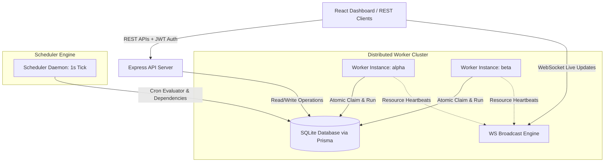

# Codity.ai Distributed Job Scheduler
https://xeno-b9cdb.web.app/

A production-inspired, highly reliable relational database-backed distributed job scheduling platform. Built with **Node.js**, **TypeScript**, **Express**, **Prisma ORM**, and **SQLite**, with a clean, minimal, Google-style **React (Vite)** dashboard and real-time WebSocket telemetry.

---

## 1. System Architecture



---

## 2. Project Directory Structure

```text
├── backend/
│   ├── prisma/
│   │   └── schema.prisma      # Relational SQLite database design
│   ├── src/
│   │   ├── engine/
│   │   │   ├── ai.ts          # Heuristic-based AI diagnostics generator
│   │   │   ├── scheduler.ts   # Cron evaluator & delayed job promoter
│   │   │   └── worker.ts      # Concurrency controller & retry processor
│   │   ├── middleware/
│   │   │   └── auth.ts        # JWT Authentication and RBAC (Roles)
│   │   ├── routes/            # REST API controllers
│   │   ├── index.ts           # System entry point (bootstraps server + daemons)
│   │   ├── ws.ts              # WebSocket server connection tracker
│   │   ├── seed.ts            # Database seed loader
│   │   └── scheduler.test.ts  # Jest integration & unit test suite
│   ├── tsconfig.json
│   └── package.json
│
├── frontend/
│   ├── src/
│   │   ├── components/        # Dashboard panels
│   │   ├── App.tsx            # Main shell controller
│   │   ├── index.css          # Design system stylesheet (Google Minimal UI)
│   │   └── main.tsx
│   ├── tsconfig.json
│   └── package.json
│
├── API_DOCUMENTATION.md       # API Specification sheet
├── DESIGN_DECISIONS.md        # Technical trade-offs document
└── README.md                  # Setup guidelines (This file)
```

---

## 3. Quickstart Guide

This project is configured for zero-dependency local setup using SQLite.

### Prerequisites
- **Node.js** v24+
- **npm** v11+

### Step 1: Install Dependencies
Install packages for both the backend server and frontend client:
```bash
# Install backend dependencies
cd backend
npm install

# Install frontend dependencies
cd ../frontend
npm install
```

### Step 2: Initialize Database and Seed Data
Generate the Prisma Client client, push tables to the SQLite file database (`dev.db`), and load preseeded roles, projects, queues, and sample job structures:
```bash
cd ../backend

# Generate Prisma Client
npx prisma generate

# Create SQLite database and push schema
npx prisma db push

# Run the seeding script
npx ts-node src/seed.ts
```

### Step 3: Run Automated Tests
Execute the unit and integration test suite:
```bash
npm run test
```
*Note: All 10 tests run in-memory against a test SQLite database instance, checking concurrency claiming, token authentication, and retry policy backoffs.*

### Step 4: Launch the Server (Development Mode)
Run both backend APIs and the frontend Vite server in parallel:

1. **Start the Express API & WebSocket Core** (Port 4000):
   ```bash
   cd backend
   npm run dev
   ```
   *This starts the API, WebSockets broadcast server, Scheduler Tick loop, and spins up two concurrent worker threads (`worker-node-alpha` and `worker-node-beta`) to simulate a distributed worker group.*

2. **Start the React Frontend** (Port 3000):
   ```bash
   cd ../frontend
   npm run dev
   ```
   *Vite compiles assets and launches the local server. All API and WebSocket queries are proxied automatically.*

3. Open **`http://localhost:3000`** in your browser.

---

## 4. Evaluation Credentials

The database is preseeded with three role profiles to verify Role-Based Access Control (RBAC):

| Role | Email | Password | Permissions |
| :--- | :--- | :--- | :--- |
| **Admin** | `admin@example.com` | `password123` | Full CRUD access (create queues, cancel/retry jobs, delete queues/projects). |
| **Developer** | `dev@example.com` | `password123` | Create queues, configure policies, trigger immediate/recurring jobs. Can't delete projects. |
| **Viewer** | `viewer@example.com` | `password123` | Read-only access to stats, logs, worker health, and telemetry chart. All edits/toggles blocked. |

*Tip: The Sign-In screen features clickable cards that auto-fill these credentials.*
